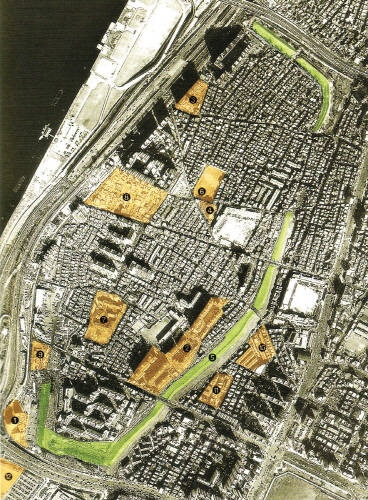
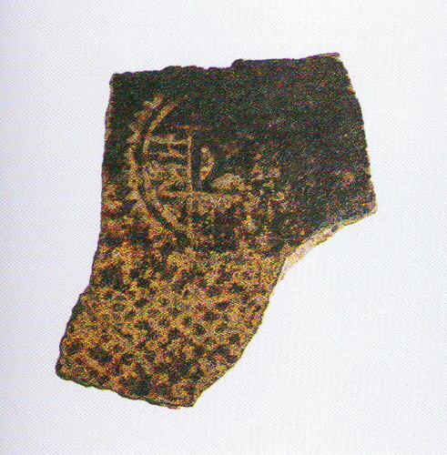
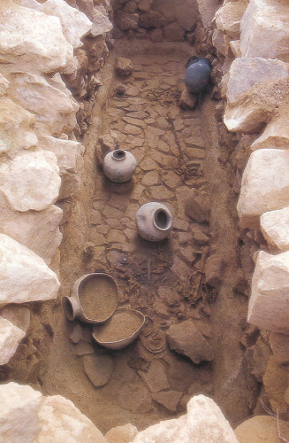
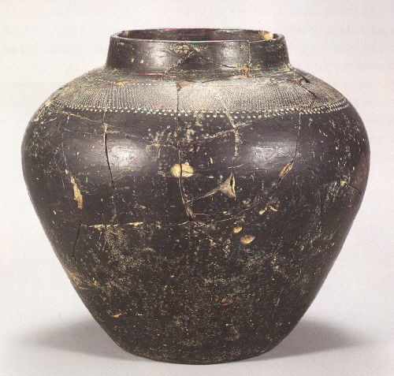

# 우리역사넷
**생성 도구:** Mozilla/5.0 (Windows NT 10.0; Win64; x64) AppleWebKit/537.36 (KHTML, like Gecko) Chrome/138.0.0.0 Safari/537.36

**소스 파일:** 백제 토기의 범주.pdf
**변환 날짜:** 2025-08-04 17:39:38

---

## 페이지 1

> 한국문화사 >  >  > 2 토기 제작전통의 형성과 발전 > 02. 삼국의 토기생산과 발전 > 백제백제의 성장과 백제 토기의 범주백제 토기하면 백제 사람들이 만들어 쓰던 토기라고 간단히 답할 수 있겠지만 좀 더 구체적으로 백제 토기란 무엇인가 하고 물으면 막상 대답하기가 어려워진다. 왜냐하면 백제라는 역사적 실체는700여 년을 거치면서 그 영역이 자주 변해왔고 그 안에서 사용되던 토기 역시 매우 복잡하여 주변의 토기와 접촉하면서 그 양상을 달리 해왔기 때문일 것이다. 백제의 영역에 포함되었던 지역을 크게 보면 한강 유역, 금강 유역, 영산강 유역이라 할 수 있다. 한성 시기에는 한강 유역을 중심으로 하여 금강 유역을 통합한 범위를 영역으로 하였으나 마지막 사비시기에는 금강 유역을 중심으로 하여 영산강 유역을 통합한국가였다. 백제는 한강 중류에 자리 잡고 있던 마한의 한 소국에서 출발하여 이웃한 소국들을 통합하면서 국가로 성장한다. 한편, 백제 토기는 원삼국시대 마한 지역의 공통된 토기문화 안에서 백제 고유의 제작 기술과 기종(器種)이 등장하면서 성립하게 된다. 그래서 ‘백제토기는 국가 단계로서의 백제에서 제작 사용한 토기’라고37) 개념을 정의하는 견해가 나왔다. 이 주장에 따르면 백제는 3세기 후반이 되면 더 이상 소국이 아니라 국가로 등장하였다고 하며 국가 형성의 물질적인 징후가 바로 마한의 공통된 토기 양식이 아닌 독특한 백제 토기의 성립이라고 한다. 그리고 백제 국가의 중심지에서 발생한 백제 토기가 주변지역으로 확산되어 그 지역의 마한토기를 대체해 나갔다고 본다.
#### 38) 이 견해가 대세론으로는 옳다고 생각하지만 3세기를 국가 성립
기로 보는 점과 이 무렵에 백제 양식이 성립한다고 보는 점은 무리한 생각이 아닐까 한다. 『삼국사기』 백제본기에 따르면 백제는 고구려 계통의 이주민이 남하하여 기원전 1세기에 국가를 건설하고 하남(河南) 위례성(慰禮城, 지금의 서울 송파구·강남구 일대)에 도읍을 정한 것으로 되어 있다. 그러나 『삼국지』 위서 동이전에는 한반도 중부와 서부 일대에 마한(馬韓)의 70여 소국이 자리를 잡고 있었던 것으로 전하고 있으며 그 중에 백제국(佰濟國)이라는 소국의 이름을 찾을 수있다. 물론 『삼국사기』의 기록은 신화적인 성격이고 국가의 성립이 어떤 의미인지는 판단하기 어렵다. 하지만 백제가 중앙집권을 달성한 국가의 수준에 이르지는 못하였다 하더라도 백제라는 정치 집단은 『삼국지』가 편찬된 3세기 이전부터 존재하였음이 분명하다. ＜풍납토성＞풍납토성 전경과 발굴지점(2002년 항공사진) 25. 8. 1. 오후 12:28우리역사넷https://contents.history.go.kr/front/km/print.do?levelId=km_032_0040_0020_0020_00101/3

## 페이지 2

＜중국 서진대 자기편＞몽촌토성 저장혈에서 발견된 전문도기편(錢文陶器片) 문헌적인 증거들과 최근에 이루어진 고고학적 발굴을 통해 얻은 자료를 종합하여 보았을 때 백제의 성립과 성장에 관하여 다음 두 가지 사실은 부정하기 어렵다. 첫째로, 백제는 그 지배세력의 계통이 누구이든 마한의 여러 소국들 중에 하나로 출발하여 성장하였고 그 중심지는 서울의 한강이남 지역에 해당될 것이다. 둘째로, 몽촌토성(夢村土城)과 풍납토성(風納土城)에서 발견된 서진대(西晋代)의 전문호(錢文壺)의 존재로 본다면 3세기 무렵의 백제는 이 일대를 중심지로 삼고 중국과 교섭할 수 있을 정도의 정치세력으로 성장하였다는 사실이다. 하지만 3세기 후반의 백제는 마한 소국 중에 우월한 정치집단일 뿐이지 주변 정치체를 통합하여 중앙집권화한 정부조직을 구축하였다는 고고학적 증거는 없다. ＜용원리 9호석곽묘＞4세기 후반부터 초기국가 백제에 복속한 지방세력들이 제 지역에 고분군을 축조한다. 지배계급의 고분에서는 환두대도나 금제귀걸이 같은 금은으로장식된 물품과 함께 중국으로부터 수입된 자기와 정교하게 만든 한성백제의 토기 등이 출토된다. 25. 8. 1. 오후 12:28우리역사넷https://contents.history.go.kr/front/km/print.do?levelId=km_032_0040_0020_0020_00102/3

## 페이지 3

＜정교하게 제작된 한성백제 흑색마연토기＞백제 중앙으로부터 지방권력자에게 분배되었던 위세품 중에 하나로 보인다. 문헌 증거나 고고학 자료로 볼 때, 백제가 주변 마한세력을 통합하여 영토를 크게 확장하는 시기는 4세기 중·후반 근초고왕 때로보인다. 이 무렵 근초고왕은 북쪽으로 평양성을 함락하여 고국원왕을 전사시켰으며 남쪽으로 진출하여 가야와 영산강 유역의 세력을 평정하고 섬진강 하구를 장악하여 왜와의 통교를 시작하였다는 것이역사학계의 통설이다. 이러한 점에서 4세기 후반 무렵을 백제 초기국가 성립기로 보아도 틀리지는 않을 듯싶다. 최근 금강 유역과 한강 중유역에서 발견되는 지역집단의 수장묘에서는 이전에 마한의 지배집단 분묘에서는 볼 수 없었던 다양한 금공품(金工品), 새로운 무기체계와 백제스타일의 토기, 그리고 중국 자기 등이 출토된다. 이러한 유물은 이 지역집단의 수장들이 백제에 복속하고 중앙 정부와의 긴밀한 관계를 통해 얻은 귀중품, 혹은 위세품이라고 할 수 있으며 이러한 관계 속에 자연스럽게 백제양식의 토기도 받아들이게 된다. 이러한성격의 고분군이 등장하는 시기는 3세기가 아니라 4세기 후반 이전으로는 올려 볼 수 없다. 39) 초기국가 형성 이후 100년을 넘지 못하고 백제는 고구려의 압박에 의하여 도읍을 한성(漢城, 서울 강남 지역)에서 웅진(熊津)으로옮기고 다시 호남의 평야지대로 진출하기 위하여 사비(泗比)로 천도한다. 이러한 중심지의 이동 과정에서 한강 유역에 대한 지배권을 상실하는 대신 충청·전라 지역에 대한 지배권력을 확대하며 직접적인 지방 지배를 실행하면서 고대 국가의 내실을 다지게 된다. 백제가 호서 지역과 호남 지역을 영역화하는 가운데 영산강 유역도 백제에 복속되었으리라 여겨진다. 그러나 이 지역은 6세기 중엽까지 정치적으로나 문화적으로 독자성을 잃지 않았다. 이 무렵까지 영산강 유역에는 대형의 분구묘들이 지속적으로 축조되었으며 ‘영산강 양식(榮山江樣式)’이라
#### 40) 할 만한 토기 양식이
존속하였기에 그러한 추론이 가능하다. 백제가 직접 지배를 위한 지방통치체제를 확대해 나가면서 재지적인 세력집단을 흡수·통합하는 과정은 6세기까지 지속된다. 백제 토기의 개념은 두 가지 관점에서 정의해 둘 필요가 있다. 첫째로는 백제 토기가 제작되고 사용되었던 시기와 영역을 파악한다 음, 둘째로 백제 토기의 그릇 종류와 제작기술, 그리고 형태의 다양성으로 정의해야 한다. 백제사의 전개 과정에서 보았을 때정확한 시기를 획정하기는 어려우나 백제국(佰濟國)이 다른 마한의 소국보다 월등한 소국으로 등장하는 시기에 백제 토기의 고유한기종과 기형이 마한의 공통된 토기 양식으로부터 형성되어 나왔으리라고 여겨진다. 이렇게 성립한 한성백제의 토기 양식은 초기국가의 영역 안으로 확산되고 웅진 시기에는 금강 유역을 중심으로 범위가 축소되어존속하였다. 사비 시기 백제 토기는 생활용 토기의 기종과 질에 있어서의 커다란 변혁기로 이 기간 동안 회색연질의 일상용기, 전달린토기, 등잔, 호자, 변기 등의 신기종, 그리고 녹유도기 등이 제작된다. [필자] 이성주37) 朴淳發, 『漢城百濟의 誕生』, 서경, 2001, pp.89. 38) 朴淳發, 앞의 책, pp.89∼115 ; 金成南, 「百濟 漢城樣式土器의 形成과 變遷에 대하여」, 『考古學』 3-1, 2004, pp.53∼63 ; 韓志仙, 「百濟土器 成立期 樣相에 대한 再檢討」, 『百濟硏究』 41, 2005, pp.1∼27. 39) 成正鏞, 「4∼5세기 百濟의 地方支配」, 『韓國古代史硏究』 24, pp.86∼103 : 成正鏞, 『中西部 馬韓地域 百濟領域化 過程』, 서울대학교 박사학위논문, 2000. 40) 徐賢珠, 『榮山江 流域 古墳 土器 硏究』, 學硏文化社, 2006, pp.197∼204. 25. 8. 1. 오후 12:28우리역사넷https://contents.history.go.kr/front/km/print.do?levelId=km_032_0040_0020_0020_00103/3

